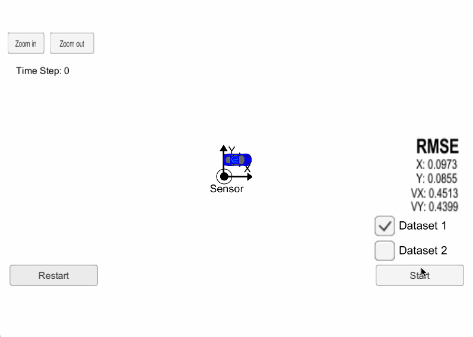
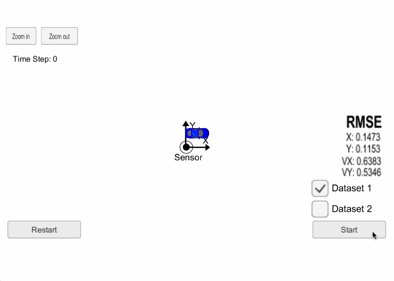
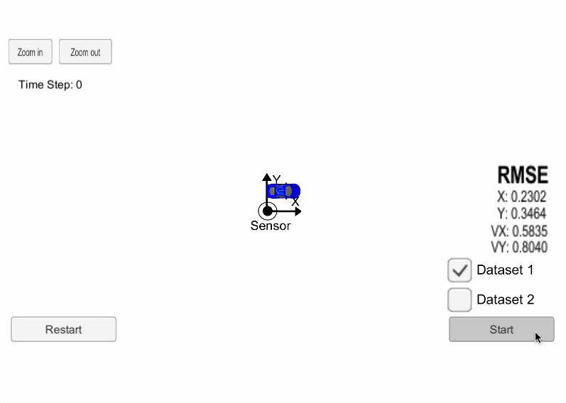
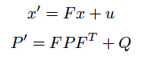
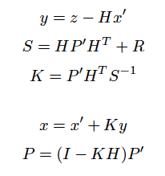

# Extended Kalman Filter 

The Project
---
Utilize a Kalman filter program in C++ to estimate the state of a moving object of interest with noisy lidar and radar measurements. The data output is visualized with the simulator provided by Udacity.

Measurments vs. EKF Estimation
---
- The EKF estimation is shown as the animations below:
  - Green Triangle: Estimation from Kalman filter
  - Blue Circle: Radar measurements with an arrow pointing in the direction of the observed angle
  - Red Circle: lidar measurements
- px, py, vx, vy output coordinates have an RMSE <= [.11, .11, 0.52, 0.52] with radar + lidar
- Using only Lidar data provides a higher accuracy compared using Radar data only
- Lidar has a higher resolution compared to radar because of the shorter wavelength, but is also more sensitive to small particles. Radar on the other hand provides information in direct velocity inforamtion. 
- Fusion of both Lidar and Radar data provides a good estimation on location px, py and speed vx, vy

|            Sensor type           |  LIDAR          |    RADAR           |  
|:--------------------------------:|:---------------:|:------------------:|
|      Wavelength Range            | IR/visible ~1um |  radio wave ~1cm   |
|      Direct Velocity Info        | no              |  yes, through doppler effect  |
|      Weather                     | affected by fog and rain | not affected by afferted weather|

## 1. Radar + Lidar

## 2. Lidar only

## 3. Radar only

---
### Scripts 
1. main.cpp: 
    * reads measrurement data 
    * creates instance of `FusionEKF` class 
    * ouput estimation and RMSE
2. FusionEKF.cpp, FusionEKF.h, 
    * initialize variables and metrices
    * initialize with first measurement
    * update F and Q based on time elapsews between measurement
    * call update steps for either radar or lidar
3. kalman_filter.cpp, kalman_filter.h: Kalman filter class and algorithm 
    * prediction

       
      
      where
      - x is the mean state vector
      - F is the state transition function
      - P is the state covariance matrix, indicating the uncertainty of the object's state
      - u is the process noise, which is a Gaussian with zero mean and covariance as Q
      - Q is the covariance matrix of the process noise

    
      
    * measurement Update

        

      where
      - y is difference between the measurement and the prediction 
      - H is the measurement function
      - z is the measurement
      - R is the covariance matrix of the measurement noise
      - I is the identity matrix
      - K is the Kalman filter gain

4. tools.cpp, and tools.h
    * calculate root mean square error (rmse)
    * calculate Jocobian matrix for radar update

### Data input
The measurement data is from "data/obj_pose-lidar-radar-synthetic-input.txt"
- Radar data colum names: sensor_type, rho_measured, phi_measured, rhodot_measured, timestamp, x_groundtruth, y_groundtruth, vx_groundtruth, vy_groundtruth, yaw_groundtruth, yawrate_groundtruth.
- lidar data colum names: sensor_type, x_measured, y_measured, timestamp, x_groundtruth, y_groundtruth, vx_groundtruth, vy_groundtruth, yaw_groundtruth, yawrate_groundtruth.

### Dependencies
* cmake >= 3.5
  * All OSes: [click here for installation instructions](https://cmake.org/install/)
* make >= 4.1 (Linux, Mac), 3.81 (Windows)
  * Linux: make is installed by default on most Linux distros
  * Mac: [install Xcode command line tools to get make](https://developer.apple.com/xcode/features/)
  * Windows: [Click here for installation instructions](http://gnuwin32.sourceforge.net/packages/make.htm)
* gcc/g++ >= 5.4
  * Linux: gcc / g++ is installed by default on most Linux distros
  * Mac: same deal as make - [install Xcode command line tools](https://developer.apple.com/xcode/features/)
  * Windows: recommend using [MinGW](http://www.mingw.org/)

### Environment Setup
This project involves the Term 2 Simulator which can be downloaded [here](https://github.com/udacity/self-driving-car-sim/releases).

This repository includes two files that can be used to set up and install [uWebSocketIO](https://github.com/uWebSockets/uWebSockets) for either Linux or Mac systems. For windows you can use either Docker, VMware, or even [Windows 10 Bash on Ubuntu](https://www.howtogeek.com/249966/how-to-install-and-use-the-linux-bash-shell-on-windows-10/) to install uWebSocketIO. Please see the uWebSocketIO Starter Guide page in the classroom within the EKF Project lesson for the required version and installation scripts.

Once the install for uWebSocketIO is complete, the main program can be built and run by doing the following from the project top directory.

### Build and Execution
1. mkdir build
2. cd build
3. cmake ..
4. make
5. ./ExtendedKF

### Other resource

1. Do my best to stick to [Google's C++ style guide](https://google.github.io/styleguide/cppguide.html).
2. I found some more interesting readings in lidar vs radar in the following link [LiDAR vs RADAR Remote Sensing](http://lidarradar.com/info/lidar-vs-radar-remote-sensing)

